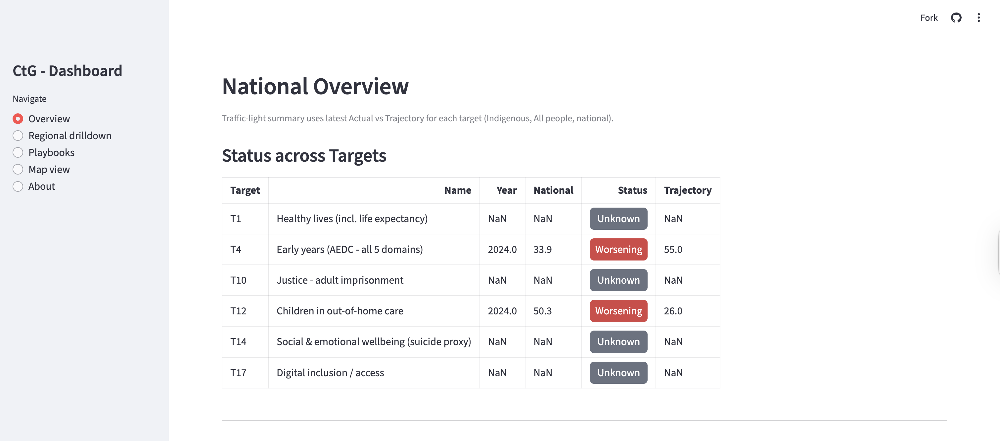

# CTG Multiplier Map (GovHack 2025)

A lightweight Streamlit dashboard to explore Closing the Gap outcomes, find positive-deviant regions, and view Priority Reforms signals.

## Features
- Overview: Traffic-light statuses (Actual vs Trajectory) across targets.
- Regional drilldown: Trends for a selected state vs national & trajectory.
- Playbooks: One-pager snapshot per state (CSV and optional PDF).
- Map view: Bubble map using state centroids to visualise positive deviants.
- Priority Reforms: Load either a ready-made proxy or granular signals to compute a 0-100 index.

## Repository structure
```
/
├─ app.py
├─ requirements.txt
├─ data/
│  ├─ ctg-202507-ctg01-healthy-lives-dataset.csv
│  ├─ ctg-202507-ctg02-healthy-birthweight-dataset.csv   # optional
│  ├─ ctg-202507-ctg04-early-years-dataset.csv
│  ├─ ctg-202507-ctg10-justice-dataset.csv
│  ├─ ctg-202507-ctg12-child-protection-dataset.csv
│  ├─ ctg-202507-ctg14-wellbeing-dataset.csv
│  └─ ctg-202507-ctg17-digital-inclusion-dataset.csv
├─ priority_reforms_proxy_by_state.csv                    # optional
└─ priority_reforms_signals.csv                           # optional (state, signal, weight)
```

## Requirements
```
streamlit
pandas
numpy
reportlab   # for PDF export (optional; remove if not needed)
```

## Run locally
```bash
python -m pip install --upgrade pip
pip install -r requirements.txt
streamlit run app.py
```

## Deploy to Streamlit Cloud
1. Push repo to GitHub.
2. Go to https://share.streamlit.io -> New app -> choose repo/branch.
3. Main file path: app.py -> Deploy.

## Here is an image:


